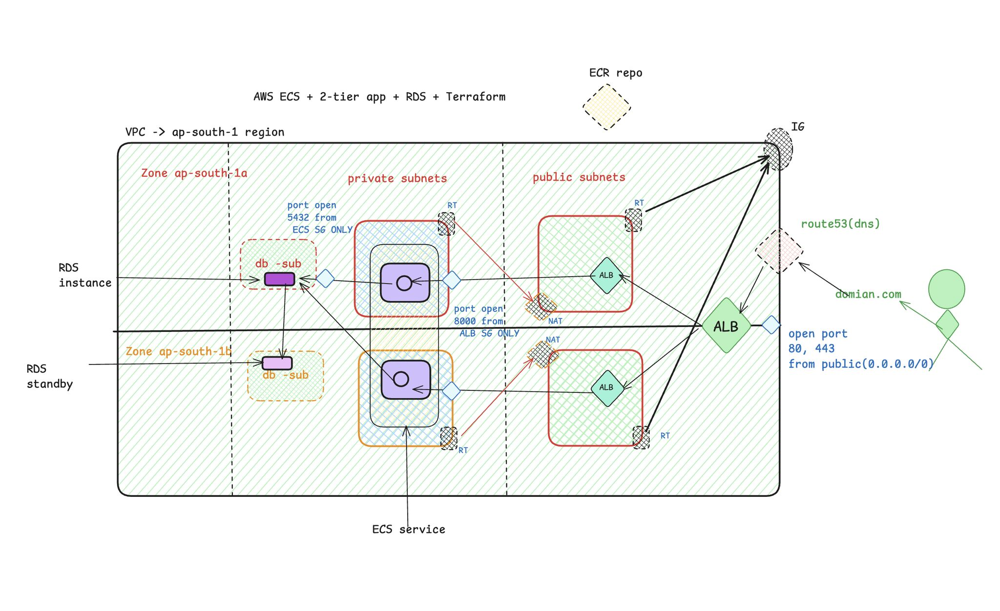
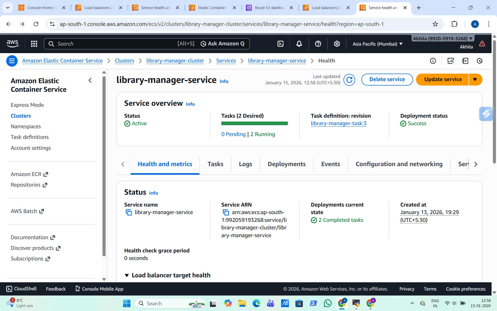
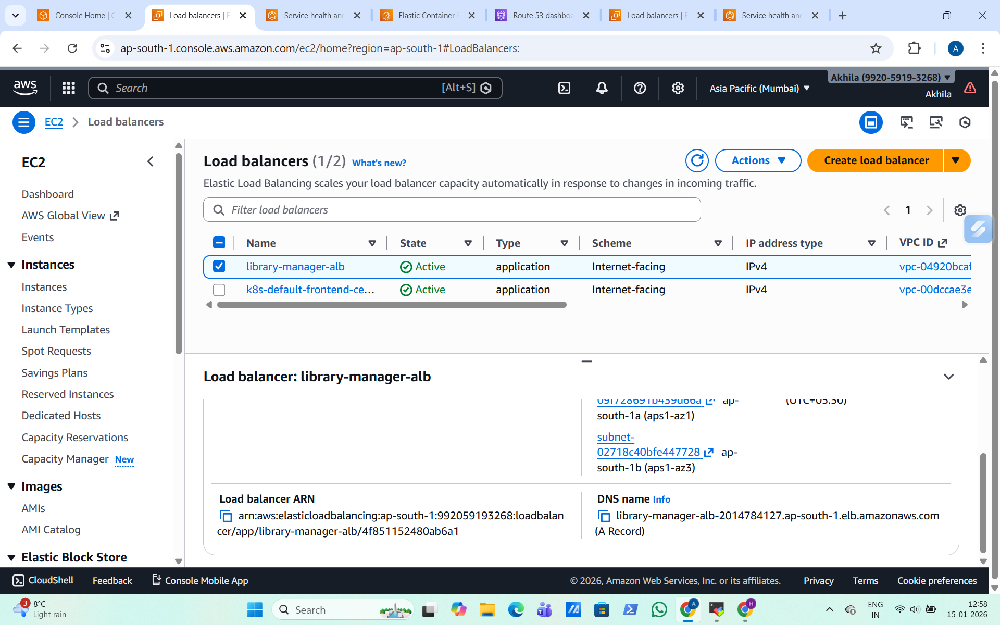
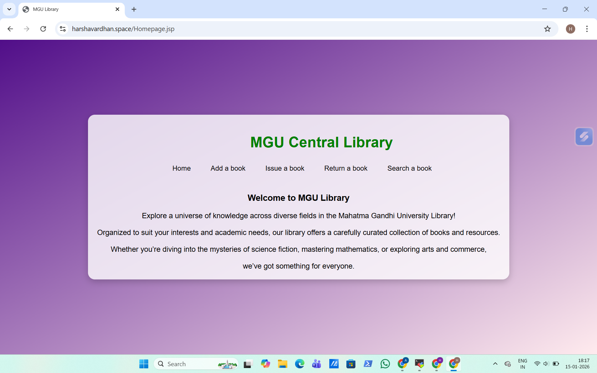

# Terraform – AWS Cloud Infrastructure (ECS)

This folder contains Terraform code used to provision the complete
AWS cloud infrastructure for the **Library Manager two-tier application**
using **Amazon ECS**.

The infrastructure follows cloud best practices with network isolation,
load balancing, and managed database services.

---

## Architecture Overview

The application is deployed using a **two-tier architecture**:

A full end-to-end deployment walkthrough (Terraform → ECS → ALB → RDS):

📹 **Demo Video:**  
[Video](../assets/Library-Manager.mp4)

- **Networking**
  - Custom VPC
  - Public and private subnets across multiple AZs
  - Internet Gateway and NAT Gateway

- **Application Layer**
  - Amazon ECS Cluster
  - ECS Service running Library Manager backend containers
  - Application Load Balancer (ALB) for traffic routing

- **Database Layer**
  - Amazon RDS (MySQL)
  - Deployed in private subnets
  - Accessible only from ECS services

- **Security**
  - IAM roles for ECS tasks and services
  - Security groups with least-privilege access

---

## Infrastructure Provisioned

- VPC with public and private subnets
- Internet Gateway and NAT Gateway
- Application Load Balancer (ALB)
- ECS Cluster and ECS Service
- ECS Task Definition for Library Manager backend
- Amazon RDS MySQL instance
- Security groups and IAM roles
- Cloud-native routing and access control

---

## Cloud Execution Proof

### ECS Cluster Running
Shows the ECS cluster and active services running successfully.

---

### Application Load Balancer Endpoint
ALB DNS endpoint routing traffic to ECS tasks.

---

### Application Accessible via Browser
Library Manager application running successfully through the ALB.

---
